# Hadoop01-入门&集群环境搭建


#### 今日内容

​     Hadoop的介绍

​     集群环境搭建准备工作

​     Linux命令和Shell脚本增强

​     集群环境搭建

 ### 大数据概述

​     大数据: 就是对海量数据进行分析处理，得到一些有价值的信息，然后帮助企业做出判断和决策.

​     处理流程:

​             1:获取数据

​              2:处理数据

​              3:展示结果

## 1：Hadoop介绍

Hadoop是一个分布式系基础框架,它允许使用简单的编程模型跨大型计算机的大型数据集进行分布式处理.

它主要解决两个问题

​      **大数据存储问题**： HDFS

​      **大数据计算问题**：MapReduce

##### 问题一:  大文件怎么存储?

> 假设一个文件非常非常大，大小为1PB/a.txt, 大到世界上所有的高级计算机都存储不下, 怎么办?


- 为了保存大文件, 需要把文件放在多个机器上
  - 文件要分块 block(128M)
  - 不同的块放在不同的 `HDFS` 节点
- 同时为了对外提供统一的访问, 让外部可以像是访问本机一样访问分布式文件系统
  - 有一个统一的 `HDFS Master`
  - 它保存整个系统的文件信息
  - 所有的文件元数据的修改都从 `Master` 开始

##### 问题二: 大数据怎么计算?

> 从一个网络日志文件中计算独立 IP, 以及其出现的次数
> 如果数据量特别大，我们可以将,整个任务拆开, 划分为比较小的任务, 从而进行计算呢。


##### 问题三: 如何将这些计算任务跑在集群中?

> 如果能够在不同的节点上并行执行, 更有更大的提升, 如何把这些任务跑在集群中?


* 可以设置一个集群的管理者, 这个地方叫做 `Yarn`
  * 这个集群管理者有一个 `Master`, 用于接收和分配任务
  * 这个集群管理者有多个 `Slave`, 用于运行任务

* * 

##### Hadoop 的组成

- **Hadoop分布式文件系统(HDFS)** 提供对应用程序数据的高吞吐量访问的分布式文件系统

* **Hadoop Common** 其他Hadoop模块所需的Java库和实用程序。这些库提供文件系统和操作系统级抽象，并包含启动Hadoop所需的必要Java文件和脚本
* **Hadoop MapReduce** 基于YARN的大型数据集并行处理系统
* **Hadoop YARN** 作业调度和集群资源管理的框架

## 2：环境搭建

在 Hadoop 具体开始前, 先来搭建一下环境

1. 创建虚拟机
    1. 安装虚拟机 VMWare
    2. 创建虚拟机
    3. 安装 CentOS
    4. 组成集群
2. 配置每台主机
    1. 关闭防火墙
    2. 关闭 SELinux
    3. 设置主机名
    4. 重启
    5. 设置时钟同步服务
    6. 配置用户权限
    7. 免密登录
3. 安装辅助软件
    1. JDK
    2. Zookeeper
4. 安装 Hadoop
    1. 下载并解压
    2. 修改配置
    3. 分发到每个节点
    4. 格式化 HDFS
    5. 启动集群

### 创建虚拟机

1：通过ISO镜像安装

2:   直接复制安装好的虚拟机

**注意事项**：windows系统确认所有的关于VmWare的服务都已经启动，

**确认好VmWare生成的网关地址，另外确认VmNet8网卡已经配置好了IP地址。**


1. 网络模式
2. 内存设置
3. 规划集群, 创建多台虚拟机

#### 1. 网络模式详解


* **桥接**
  * 把虚拟出来的网卡直接连接外部的路由器, 看起来就好像是网络中多出了一台真正的计算机一样
  * 从路由器来看, 虚拟机等同于局域网内其它的物理机

      


* **NAT**
  * 在宿主机中创建一个子网, 把虚拟机放入子网中, 子网中有一个NAT服务


* **仅主机**
  * 创建子网, 把虚拟机放入这个子网

      

#### 2. 内存设置

* 需要三台虚拟机, 并且需要同时运行, 所以总体上的占用为: $每台虚拟机内存 \times 3$
* 在分配的时候, 需要在总内存大小的基础上, 减去1-2G作为系统内存, 剩余的除以3, 作为每台虚拟机的内存

$每台机器的内存 = \left ( 总内存 - 4\right ) \div 3$


#### 3. 集群规划

| IP              | 主机名 | 环境配置                              | 安装                                      |
| --------------- | ------ | ------------------------------------- | ----------------------------------------- |
| 192.168.174.100 | node01 | 关防火墙和selinux, host映射, 时钟同步 | JDK, NameNode, ResourceManager, Zookeeper |
| 192.168.174.120 | node02 | 关防火墙和selinux, host映射, 时钟同步 | JDK, DataNode, NodeManager, Zeekeeper     |
| 192.168.174.130 | node03 | 关防火墙和selinux, host映射, 时钟同步 | JDK, DataNode, NodeManager, Zeekeeper     |

#### 4:设置ip和Mac地址

更改mac地址：

  `vim /etc/udev/rules.d/70-persistent-net.rules`

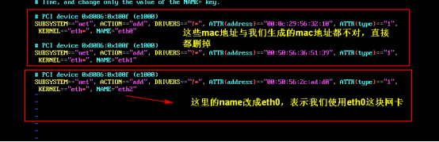

更改IP地址:

 `vim /etc/sysconfig/network-scripts/ifcfg-eth0`

​    

修改主机名(重启后永久生效)

`vi /ect/sysconfig/network`

HOSTNAME=node01

设置ip和域名映射

  `vim /etc/hosts`

## 3:Liux常用的命令

 ##### 3.1 查找命令

  **grep**命令 命令是一种强大的文本搜索工具

 格式： grep [option] pattern [file] 可使用 —help 查看更多参数。 使用实例：

 `ps -ef | grep sshd` 查找指定 ssh 服务进程

 `ps -ef | grep sshd | grep -v grep` 查找指定服务进程，排除 gerp 本身 

`grep -n 'hello' a.txt`  从文件中查找关键词，并显示行号 

---


**find命令**

find 命令在目录结构中搜索文件，并对搜索结果执行指定的操作。
使用实例：
`find . -name "*.log" -ls` 在当前目录查找以.log 结尾的文件， 并显示详细信息。
`find /root/ -perm 777` 查找/root/目录下权限为 777 的文件
`find . -size +100M` 查找当前目录大于 100M 的文件

---

**Locate命令**

locate 让使用者可以很快速的搜寻档案系统内是否有指定的档案。其方法
是先建立一个包括系统内所有档案名称及路径的数据库。之后当寻找时就只需查
询这个数据库（ /var/lib/locatedb）。
Linux 系统自动创建这个数据库， 默认每天自动更新一次，所以使用 locate
命令查不到最新变动过的文件。为了避免这种情况，可以在使用 locate 之前，
先使用 updatedb 命令，手动更新数据库。
yum -y install mlocate
使用实例：
locate /etc/sh
搜索 etc 目录下所有以 sh 开头的文件
locate pwd
查找和 pwd 相关的所有文件

##### 3.2 用户管理命令

添加普通用户

useradd   hadoop    #   这个就表示我们创建了一个普通用户

passwd   hadoop    # 表示我们需要给hadoop这个普通用户分配一个密码,密

切换用户:

   su -  用户名

**3.3 用户权限管理命令**

 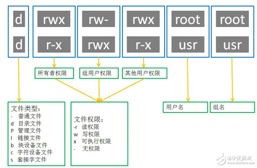


`chmod 777 a.txt`                #表示给某个文件赋予所有人的所有权限

`chmod u-x a.txt`	               #取消a.txt文件，用户“执行”权限

`chmod g+x a.txt`          	#添加a.txt文件，组“执行”权限

`chown -R hadoop:hadoop a.txt`  改变某个文件或者文件夹的所属的用户以及用户组 

 

**3.4 系统服务命令**

`service  iptables status`  #查看防火墙状态

`service  iptables stop`  #关闭防火墙

`service --status-all` # 查看系统所有的后台服务进程
`service sshd status` # 查看指定的后台服务进程的状态
`service sshd stop`
`service sshd start`
`service sshd restart`
配置后台服务进程的开机自启或关闭

`chkconfig iptables on`  #配置防火墙开机开启

`chkconfig iptables off` #配置防火墙开机关闭
`chkconfig httpd on`   ## 让 httpd 服务开机自启
`chkconfig httpd off`   ## 让 httpd 服务开机不要自启

---

## 4:Linux的Shell编程

 Shell 编程一般指 shell 脚本编程。

 **语法:**

​    使用 vi 编辑器新建一个文件 hello.sh 

~~~shell
#!/bin/bash 
 echo "Hello World !" 
~~~

 **执行**：

​    方式1：

​          sh    hello.sh

   方式2

​          chmod +x ./hello.sh   #使脚本具有执行权限

​          ./hello.sh    #执行脚本

 **4.1变量:**

   局部变量

~~~shell
#!/bin/bash
str="hello"
echo ${str}world
~~~

  环境变量

​    echo $PATH

​    echo $HOME

 **4.2 特殊字符**

| $#   | 传递到脚本的参数个数                                         |
| ---- | ------------------------------------------------------------ |
| $*   | 以一个单字符串显示所有向脚本传递的参数。                     |
| $$   | 脚本运行的当前进程 ID 号                                     |
| $!   | 后台运行的最后一个进程的 ID 号                               |
| $@   | 与$*相同，但是使用时加引号，并在引号中返回每个参数。         |
| $?   | 显示最后命令的退出状态。 0 表示没有错误，其他任何值表明有错误。 |

~~~shell
#!/bin/bash
echo "第一个参数为： $1";
echo "参数个数为： $#";
echo "传递的参数作为一个字符串显示： $*";
~~~

  执行: ./test.sh 1 2 3 

 **4.3 运算符**

 ~~~shell
#!/bin/bash
a=1;
b=2;
echo `expr $a + $b`;
echo  $((a+b));
echo  $[a+b];
 ~~~

**4.4 if语句**

  ~~~shell
#!/bin/bash
read -p "please input your name:" NAME ## read命令用于从控制台读取输入数据
## printf '%s\n' $NAME
if [ $NAME = root ]
	then
		echo "hello ${NAME}, welcome !"
	elif [ $NAME = itcast ]
	then
		echo "hello ${NAME}, welcome !"
	else
		echo "Get out Please!"
fi

  ~~~

**4.5 for语句**

 方式1：

~~~shell
#!/bin/bash
for N in 1 2 3 
do
    echo $N
done
~~~

方式2：

~~~shell
#!/bin/bash
for ((i = 0; i <= 5; i++)) 
 do 
    echo "welcome $i times" 
 done 
~~~

**4.6 函数**

~~~shell
#!/bin/bash
funWithReturn(){
echo "这个函数会对输入的两个数字进行相加运算..."
echo "输入第一个数字: "
read aNum
echo "输入第二个数字: "
read anotherNum
echo "两个数字分别为 $aNum 和 $anotherNum !"
return $(($aNum+$anotherNum))
} 
funWithReturn
echo "输入的两个数字之和为 $? !"
~~~

##5:环境配置

#### 5.1:三台虚拟机关闭防火墙

三台机器执行以下命令（root用户来执行）

~~~shell
service iptables stop   #关闭防火墙
chkconfig iptables off  #禁止开机启动
~~~

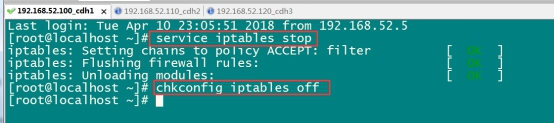 

####5.2三台机器关闭selinux

- 什么是SELinux
  - SELinux是Linux的一种安全子系统
  - Linux中的权限管理是针对于文件的, 而不是针对进程的, 也就是说, 如果root启动了某个进程, 则这个进程可以操作任何一个文件
  - SELinux在Linux的文件权限之外, 增加了对进程的限制, 进程只能在进程允许的范围内操作资源
- 为什么要关闭SELinux
  - 如果开启了SELinux, 需要做非常复杂的配置, 才能正常使用系统, 在学习阶段, 在非生产环境, 一般不使用SELinux
- SELinux的工作模式
  - `enforcing` 强制模式
  - `permissive` 宽容模式
  - `disable` 关闭

```shell
# 修改selinux的配置文件
vi /etc/selinux/config
```


####5.3 三台机器机器免密码登录


- **为什么要免密登录**
  - Hadoop 节点众多, 所以一般在主节点启动从节点, 这个时候就需要程序自动在主节点登录到从节点中, 如果不能免密就每次都要输入密码, 非常麻烦
- **免密 SSH 登录的原理**
  1. 需要先在 B节点 配置 A节点 的公钥
  2. A节点 请求 B节点 要求登录
  3. B节点 使用 A节点 的公钥, 加密一段随机文本
  4. A节点 使用私钥解密, 并发回给 B节点
  5. B节点 验证文本是否正确

**第一步：三台机器生成公钥与私钥**

在三台机器执行以下命令，生成公钥与私钥

ssh-keygen -t rsa

执行该命令之后，按下三个回车即可

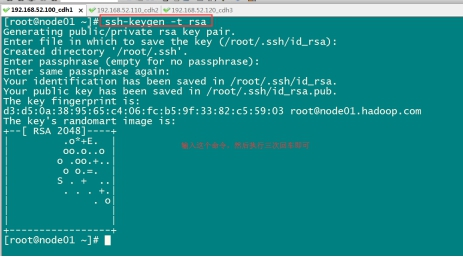 

**第二步：拷贝公钥到同一台机器**

三台机器将拷贝公钥到第一台机器

三台机器执行命令：

ssh-copy-id node01

 **第三步:复制第一台机器的认证到其他机器**

将第一台机器的公钥拷贝到其他机器上

在第一天机器上面指向以下命令

scp /root/.ssh/authorized_keys node02:/root/.ssh

scp /root/.ssh/authorized_keys node03:/root/.ssh

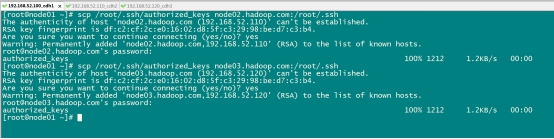 

 

#### 5.4三台机器时钟同步

- 为什么需要时间同步
  - 因为很多分布式系统是有状态的, 比如说存储一个数据, A节点 记录的时间是 1, B节点 记录的时间是 2, 就会出问题

```shell
## 安装
yum install -y ntp

## 启动定时任务
crontab -e
```

随后在输入界面键入

```shell
*/1 * * * * /usr/sbin/ntpdate ntp4.aliyun.com;
```

##6:装辅助软件

#### 6.1 每台主机安装jdk

 查看自带的openjdk

`rpm -qa | grep java`

卸载系统自带的openjdk

`rpm -e java-1.6.0-openjdk-1.6.0.41-1.13.13.1.el6_8.x86_64 tzdata-java-2016j-1.el6.noarch java-1.7.0-openjdk-1.7.0.131-2.6.9.0.el6_8.x86_64 --nodeps`

上传jdk并解压然后配置环境变量

所有软件的安装路径

`mkdir -p /export/servers`

所有软件压缩包的存放路径

`mkdir -p /export/softwares`

上传jdk到/export/softwares路径下去，并解压

`tar -zxvf jdk-8u141-linux-x64.tar.gz -C ../servers/`

配置环境变量

`vim /etc/profile`

```shell
export JAVA_HOME=/export/servers/jdk1.8.0_141
export PATH=:$JAVA_HOME/bin:$PATH
```

修改完成之后记得  source /etc/profile生效

## 7:Zookeeper

####7.1 Zookeeper 的概述

- Zookeeper 是一个开源的分布式协调服务框架 ,主要用来解决分布式集群中 应用系统的一致性问题
- Zookeeper 是 Google Chubby 思想的一个开源实现
- Zookeeper 本质上是一个分布式文件系统, 适合存放小文件, 通过文件系统来实现分布式协调

分布式文件系统?


- 在上图左侧, Zookeeper 中存储的其实是一个又一个 Znode, Znode 是 Zookeeper 中的节点
  - Znode 是有路径的, 例如 `/data/host1`, `/data/host2`, 这个路径也可以理解为是 Znode 的 Name
  - Znode 也可以携带数据, 例如说某个 Znode 的路径是 `/data/host1`, 其值是一个字符串 `"192.168.0.1"`
- 正因为 Znode 的特性, 所以 Zookeeper 可以对外提供出一个类似于文件系统的试图, 可以通过操作文件系统的方式操作 Zookeeper
  - 使用路径获取 Znode
  - 获取 Znode 携带的数据
  - 修改 Znode 携带的数据
  - 删除 Znode
  - 添加 Znode
  - 等等...

Zookeeper 是分布式的

首先呢, Zookeeper 是分为服务端和客户端的, 客户端有 Java 的客户端, 有 Shell 命令行的客户端等, 客户端通过一个类似于文件系统的 API 来访问 Zookeeper 集群


但是事实上, 客户端最终是直接访问 Zookeeper 集群, 集群中有两大类角色, 一类是 Leader, 一类是 Follower, 其实就是主从, Leader 负责读和写, Follower 只能读, 遇到会产生修改的请求会转发给 Leader 处理, 这是因为 Zookeeper 本质上就是为了在分布式环境中对消息的一致性的支持, 而 Zookeeper 所基于的 ZAB 协议是 Paxos 协议的一个变种, ZAB 协议中是有一个全局的事务生成者, 就是 Leader, 修改设计到在分布式环境下对事务达成一致, 必须由 Leader 发起


举个例子?


比如说一个常见的分布式主从系统, 如果有 ZK 在的话, 主节点不需要和每个从节点保持连接, 只需要监听从节点创建的 Znode, 便可以知道谁在线

Zookeeper 能做什么?

- 发布订阅
- 命名服务
- 分布式锁
- 分布式协调

#### 7.2 Zookeeper安装

| 服务器IP        | 主机名 | myid的值 |
| --------------- | ------ | -------- |
| 192.168.174.100 | node01 | 1        |
| 192.168.174.110 | node02 | 2        |
| 192.168.174.120 | node03 | 3        |

 **第一步：下载zookeeeper的压缩包，下载网址如下**

<http://archive.apache.org/dist/zookeeper/>

我们在这个网址下载我们使用的zk版本为3.4.9

下载完成之后，上传到我们的linux的/export/softwares路径下准备进行安装

**第二步：解压**

解压zookeeper的压缩包到/export/servers路径下去，然后准备进行安装

~~~shell
cd /export/software

tar -zxvf zookeeper-3.4.9.tar.gz -C ../servers/ 
~~~

**第三步：修改配置文件**

第一台机器修改配置文件

~~~shell
cd /export/servers/zookeeper-3.4.9/conf/

cp zoo_sample.cfg zoo.cfg

mkdir -p /export/servers/zookeeper-3.4.9/zkdatas/
~~~

`vim  zoo.cfg`

~~~shell
dataDir=/export/servers/zookeeper-3.4.9/zkdatas
# 保留多少个快照
autopurge.snapRetainCount=3
# 日志多少小时清理一次
autopurge.purgeInterval=1
# 集群中服务器地址
server.1=node01:2888:3888
server.2=node02:2888:3888
server.3=node03:2888:3888
~~~

 

**第四步：添加myid配置**

在第一台机器的

/export/servers/zookeeper-3.4.9/zkdatas /这个路径下创建一个文件，文件名为myid ,文件内容为1

`echo 1 > /export/servers/zookeeper-3.4.9/zkdatas/myid` 

**第五步：安装包分发并修改myid的值**

安装包分发到其他机器

第一台机器上面执行以下两个命令

`scp -r  /export/servers/zookeeper-3.4.9/ node02:/export/servers/`

`scp -r  /export/servers/zookeeper-3.4.9/ node03:/export/servers/`

第二台机器上修改myid的值为2

`echo 2 > /export/servers/zookeeper-3.4.9/zkdatas/myid`

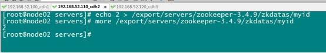 

第三台机器上修改myid的值为3

`echo 3 > /export/servers/zookeeper-3.4.9/zkdatas/myid`

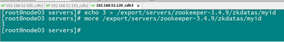 

**第六步**：三台机器启动zookeeper服务

三台机器启动zookeeper服务

这个命令三台机器都要执行

`/export/servers/zookeeper-3.4.9/bin/zkServer.sh start`

查看启动状态

`/export/servers/zookeeper-3.4.9/bin/zkServer.sh  status`

---

#### 7.3 Zookeeper的Shell 客户端操作

| 命令                             | 说明                                          | 参数                                             |
| -------------------------------- | --------------------------------------------- | ------------------------------------------------ |
| `create [-s] [-e] path data acl` | 创建Znode                                     | -s 指定是顺序节点<br>-e 指定是临时节点           |
| `ls path [watch]`                | 列出Path下所有子Znode                         |                                                  |
| `get path [watch]`               | 获取Path对应的Znode的数据和属性               |                                                  |
| `ls2 path [watch]`               | 查看Path下所有子Znode以及子Znode的属性        |                                                  |
| `set path data [version]`        | 更新节点                                      | version 数据版本                                 |
| `delete path [version]`          | 删除节点, 如果要删除的节点有子Znode则无法删除 | version 数据版本                                 |
| `rmr path`                       | 删除节点, 如果有子Znode则递归删除             |                                                  |
| `setquota -n|-b val path`        | 修改Znode配额                                 | -n 设置子节点最大个数<br>-b 设置节点数据最大长度 |
| `history`                        | 列出历史记录                                  |                                                  |

1：创建普通节点

 `create /app1 hello`

2: 创建顺序节点

`create -s /app3 world`

3:创建临时节点

`create -e /tempnode world`

4:创建顺序的临时节点

`create -s -e /tempnode2 aaa`

5:获取节点数据

   `get /app1`

6:修改节点数据

   `set /app1  xxx`

7:删除节点

   delete  /app1 删除的节点不能有子节点

​    rmr    /app1 递归删除

Znode 的特点

- 文件系统的核心是 `Znode`
- 如果想要选取一个 `Znode`, 需要使用路径的形式, 例如 `/test1/test11`
- Znode 本身并不是文件, 也不是文件夹, Znode 因为具有一个类似于 Name 的路径, 所以可以从逻辑上实现一个树状文件系统
- ZK 保证 Znode 访问的原子性, 不会出现部分 ZK 节点更新成功, 部分 ZK 节点更新失败的问题
- `Znode` 中数据是有大小限制的, 最大只能为`1M`
- `Znode`是由三个部分构成
  - `stat`: 状态, Znode的权限信息, 版本等
  - `data`: 数据, 每个Znode都是可以携带数据的, 无论是否有子节点
  - `children`: 子节点列表

Znode 的类型

- 每个`Znode`有两大特性, 可以构成四种不同类型的`Znode`
  - 持久性
    - `持久` 客户端断开时, 不会删除持有的Znode
    - `临时` 客户端断开时, 删除所有持有的Znode, **临时Znode不允许有子Znode**
  - 顺序性
    - `有序` 创建的Znode有先后顺序, 顺序就是在后面追加一个序列号, 序列号是由父节点管理的自增
    - `无序` 创建的Znode没有先后顺序
- `Znode`的属性
  - `dataVersion` 数据版本, 每次当`Znode`中的数据发生变化的时候, `dataVersion`都会自增一下
  - `cversion` 节点版本, 每次当`Znode`的节点发生变化的时候, `cversion`都会自增
  - `aclVersion` `ACL(Access Control List)`的版本号, 当`Znode`的权限信息发生变化的时候aclVersion会自增
  - `zxid` 事务ID
  - `ctime` 创建时间
  - `mtime` 最近一次更新的时间
  - `ephemeralOwner` 如果`Znode`为临时节点, `ephemeralOwner`表示与该节点关联的`SessionId`

通知机制

- 通知类似于数据库中的触发器, 对某个Znode设置 `Watcher`, 当Znode发生变化的时候, `WatchManager`会调用对应的`Watcher`
- 当Znode发生删除, 修改, 创建, 子节点修改的时候, 对应的`Watcher`会得到通知
- `Watcher`的特点
  - **一次性触发** 一个 `Watcher` 只会被触发一次, 如果需要继续监听, 则需要再次添加 `Watcher`
  - 事件封装: `Watcher` 得到的事件是被封装过的, 包括三个内容 `keeperState, eventType, path`

| KeeperState   | EventType        | 触发条件                 | 说明                               |
| ------------- | ---------------- | ------------------------ | ---------------------------------- |
|               | None             | 连接成功                 |                                    |
| SyncConnected | NodeCreated      | Znode被创建              | 此时处于连接状态                   |
| SyncConnected | NodeDeleted      | Znode被删除              | 此时处于连接状态                   |
| SyncConnected | NodeDataChanged  | Znode数据被改变          | 此时处于连接状态                   |
| SyncConnected | NodeChildChanged | Znode的子Znode数据被改变 | 此时处于连接状态                   |
| Disconnected  | None             | 客户端和服务端断开连接   | 此时客户端和服务器处于断开连接状态 |
| Expired       | None             | 会话超时                 | 会收到一个SessionExpiredException  |
| AuthFailed    | None             | 权限验证失败             | 会收到一个AuthFailedException      |

会话

- 在ZK中所有的客户端和服务器的交互都是在某一个`Session`中的, 客户端和服务器创建一个连接的时候同时也会创建一个`Session`
- `Session`会在不同的状态之间进行切换: `CONNECTING`, `CONNECTED`, `RECONNECTING`, `RECONNECTED`, `CLOSED`
- ZK中的会话两端也需要进行心跳检测, 服务端会检测如果超过超时时间没收到客户端的心跳, 则会关闭连接, 释放资源, 关闭会话

##8:Hadoop

 #### 8.1 Hadoop的介绍

1. Hadoop最早起源于**Nutch**。Nutch的设计目标是构建一个大型的全网搜索引擎，包括网页抓取、索引、查询等功能，但随着抓取网页数量的增加，遇到了严重的可扩展性问题——如何解决数十亿网页的存储和索引问题。
2. 2003年、2004年谷歌发表的两篇论文为该问题提供了可行的解决方案。

——分布式文件系统（GFS），可用于处理海量网页的**存储**

——分布式计算框架MAPREDUCE，可用于处理海量网页的**索引计算**问题。

3. Nutch的开发人员完成了相应的开源实现**HDFS**和**MAPREDUCE**，并从Nutch中剥离成为独立项目HADOOP，到2008年1月，HADOOP成为Apache顶级项目.

**狭义上来说，hadoop就是单独指代hadoop这个软件，**

   HDFS    ：分布式文件系统

   MapReduce : 分布式计算系统

**广义上来说，hadoop指代大数据的一个生态圈，包括很多其他的软件**

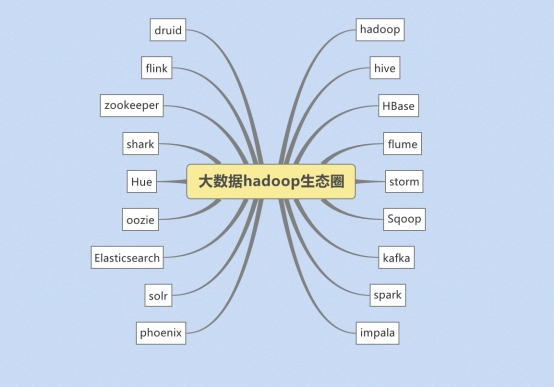 

  

#### 8.2、hadoop的历史版本介绍

1.x版本系列：hadoop版本当中的第二代开源版本，主要修复0.x版本的一些bug等

2.x版本系列：架构产生重大变化，引入了yarn平台等许多新特性

3.x版本系列:  加入多namenoode新特性

#### 8.3、hadoop三大公司发型版本介绍

**免费开源版本apache:**

<http://hadoop.apache.org/>

优点：拥有全世界的开源贡献者，代码更新迭代版本比较快，

缺点：版本的升级，版本的维护，版本的兼容性，版本的补丁都可能考虑不太周到，\

apache所有软件的下载地址（包括各种历史版本）：

<http://archive.apache.org/dist/>

 

**免费开源版本hortonWorks：**

<https://hortonworks.com/>

hortonworks主要是雅虎主导Hadoop开发的副总裁，带领二十几个核心成员成立Hortonworks，核心产品软件HDP（ambari），HDF免费开源，并且提供一整套的web管理界面，供我们可以通过web界面管理我们的集群状态，web管理界面软件HDF网址（<http://ambari.apache.org/>）

 

**软件收费版本ClouderaManager:**

<https://www.cloudera.com/>

cloudera主要是美国一家大数据公司在apache开源hadoop的版本上，通过自己公司内部的各种补丁，实现版本之间的稳定运行，大数据生态圈的各个版本的软件都提供了对应的版本，解决了版本的升级困难，版本兼容性等各种问题

 

#### 8.4、hadoop的架构模型（1.x，2.x的各种架构模型介绍）

**8.4.1、1.x的版本架构模型介绍**

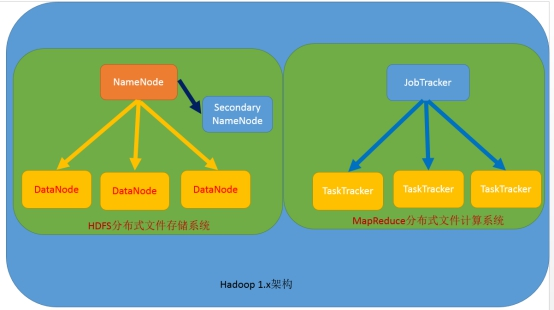 

文件系统核心模块：

NameNode：集群当中的主节点，管理元数据(文件的大小，文件的位置，文件的权限)，主要用于管理集群当中的各种数据

secondaryNameNode：主要能用于hadoop当中元数据信息的辅助管理

DataNode：集群当中的从节点，主要用于存储集群当中的各种数据

数据计算核心模块：

JobTracker：接收用户的计算请求任务，并分配任务给从节点

TaskTracker：负责执行主节点JobTracker分配的任务

**8.4.2、2.x的版本架构模型介绍**

 **第一种：NameNode与ResourceManager单节点架构模型**

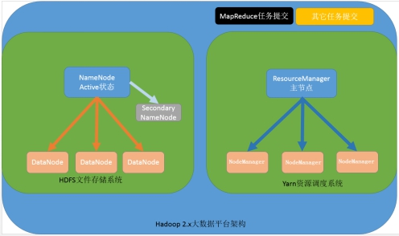 

文件系统核心模块：

NameNode：集群当中的主节点，主要用于管理集群当中的各种数据

secondaryNameNode：主要能用于hadoop当中元数据信息的辅助管理

DataNode：集群当中的从节点，主要用于存储集群当中的各种数据

数据计算核心模块：

ResourceManager：接收用户的计算请求任务，并负责集群的资源分配

NodeManager：负责执行主节点APPmaster分配的任务

**第二种：NameNode单节点与ResourceManager高可用架构模型**

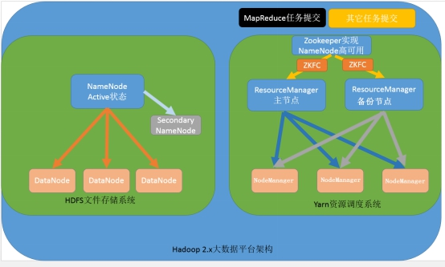 

文件系统核心模块：

NameNode：集群当中的主节点，主要用于管理集群当中的各种数据

secondaryNameNode：主要能用于hadoop当中元数据信息的辅助管理

DataNode：集群当中的从节点，主要用于存储集群当中的各种数据

数据计算核心模块：

ResourceManager：接收用户的计算请求任务，并负责集群的资源分配，以及计算任务的划分，通过zookeeper实现ResourceManager的高可用

NodeManager：负责执行主节点ResourceManager分配的任务

**第三种：NameNode高可用与ResourceManager单节点架构模型**

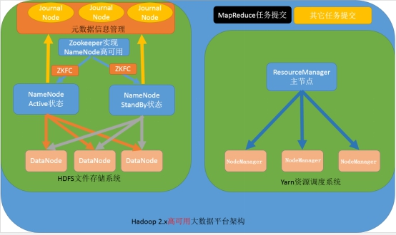 

文件系统核心模块：

NameNode：集群当中的主节点，主要用于管理集群当中的各种数据，其中nameNode可以有两个，形成高可用状态

DataNode：集群当中的从节点，主要用于存储集群当中的各种数据

JournalNode：文件系统元数据信息管理

数据计算核心模块：

ResourceManager：接收用户的计算请求任务，并负责集群的资源分配，以及计算任务的划分

NodeManager：负责执行主节点ResourceManager分配的任务

 

**第四种：NameNode与ResourceManager高可用架构模型**

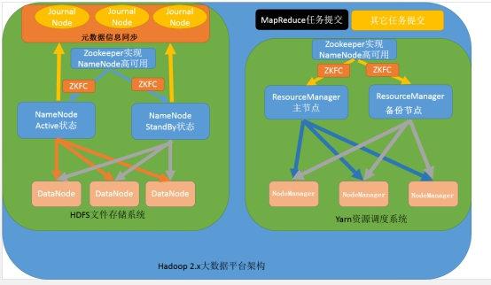 

文件系统核心模块：

NameNode：集群当中的主节点，主要用于管理集群当中的各种数据，一般都是使用两个，实现HA高可用

JournalNode：元数据信息管理进程，一般都是奇数个

DataNode：从节点，用于数据的存储

数据计算核心模块：

ResourceManager：Yarn平台的主节点，主要用于接收各种任务，通过两个，构建成高可用

NodeManager：Yarn平台的从节点，主要用于处理ResourceManager分配的任务

#### 8.2 Hadoop的安装

集群的规划:

| 服务器IP          | 192.168.174.100 | 192.168.174.110 | 192.168.174.120 |
| ----------------- | --------------- | --------------- | --------------- |
| 主机名            | node01          | node02          | node03          |
| NameNode          | 是              | 否              | 否              |
| SecondaryNameNode | 是              | 否              | 否              |
| dataNode          | 是              | 是              | 是              |
| ResourceManager   | 是              | 否              | 否              |
| NodeManager       | 是              | 是              | 是              |

1. 上传并解压
2. 修改配置文件
3. 分发安装包
4. 格式化HDFS
5. 启动集群

##### **1. 上传并解压**

1. 上传压缩包到/export/software目录
2. `cd /export/software`
3. `tar xzvf hadoop-3.1.1.tar.gz  -C ../servers`

#####**2. 修改配置文件**

配置文件的位置在 `hadoop/etc/hadoop`

######core-site.xml

```xml
<configuration>
    <property>
		<name>fs.defaultFS</name>
		<value>hdfs://node01:8020</value>
	</property>
	<!-- 临时文件存储目录 -->
	<property>
		<name>hadoop.tmp.dir</name>
		<value>/export/servers/hadoop-3.1.1/datas/tmp</value>
	</property>
    <!--  缓冲区大小，实际工作中根据服务器性能动态调整 -->
	<property>
		<name>io.file.buffer.size</name>
		<value>8192</value>
	</property>
    <!--  开启hdfs的垃圾桶机制，删除掉的数据可以从垃圾桶中回收，单位分钟 -->
	<property>
		<name>fs.trash.interval</name>
		<value>10080</value>
	</property>
</configuration>
```

######hadoop-env.sh

```shell
export JAVA_HOME=/export/servers/jdk1.8.0_141
```

######hdfs-site.xml

```xml
<configuration>
	<property>
		<name>dfs.namenode.name.dir</name>
		<value>file:///export/servers/hadoop-3.1.1/datas/namenode/namenodedatas</value>
	</property>
	<property>
		<name>dfs.blocksize</name>
		<value>134217728</value>
	</property>
	<property>
		<name>dfs.namenode.handler.count</name>
		<value>10</value>
	</property>
	<property>
		<name>dfs.datanode.data.dir</name>
		<value>file:///export/servers/hadoop-3.1.1/datas/datanode/datanodeDatas</value>
	</property>
	<property>
		<name>dfs.namenode.http-address</name>
		<value>node01:50070</value>
	</property>
	<property>
		<name>dfs.replication</name>
		<value>3</value>
	</property>
	<property>
		<name>dfs.permissions.enabled</name>
		<value>false</value>
	</property>
	<property>
		<name>dfs.namenode.checkpoint.edits.dir</name>
		<value>file:///export/servers/hadoop-3.1.1/datas/dfs/nn/snn/edits</value>
	</property>
	<property>
		<name>dfs.namenode.secondary.http-address</name>
		<value>node01.hadoop.com:50090</value>
	</property>
	<property>
		<name>dfs.namenode.edits.dir</name>
		<value>file:///export/servers/hadoop-3.1.1/datas/dfs/nn/edits</value>
	</property>
	<property>
		<name>dfs.namenode.checkpoint.dir</name>
		<value>file:///export/servers/hadoop-3.1.1/datas/dfs/snn/name</value>
	</property>
</configuration>
```

######mapred-site.xml

```xml
<configuration>
	<property>
		<name>mapreduce.framework.name</name>
		<value>yarn</value>
	</property>
	<property>
		<name>mapreduce.map.memory.mb</name>
		<value>1024</value>
	</property>
	<property>
		<name>mapreduce.map.java.opts</name>
		<value>-Xmx512M</value>
	</property>
	<property>
		<name>mapreduce.reduce.memory.mb</name>
		<value>1024</value>
	</property>
	<property>
		<name>mapreduce.reduce.java.opts</name>
		<value>-Xmx512M</value>
	</property>
	<property>
		<name>mapreduce.task.io.sort.mb</name>
		<value>256</value>
	</property>
	<property>
		<name>mapreduce.task.io.sort.factor</name>
		<value>100</value>
	</property>
	<property>
		<name>mapreduce.reduce.shuffle.parallelcopies</name>
		<value>25</value>
	</property>
	<property>
		<name>mapreduce.jobhistory.address</name>
		<value>node01.hadoop.com:10020</value>
	</property>
	<property>
		<name>mapreduce.jobhistory.webapp.address</name>
		<value>node01.hadoop.com:19888</value>
	</property>
	<property>
		<name>mapreduce.jobhistory.intermediate-done-dir</name>
		<value>/export/servers/hadoop-3.1.1/datas/jobhsitory/intermediateDoneDatas</value>
	</property>
	<property>
		<name>mapreduce.jobhistory.done-dir</name>
		<value>/export/servers/hadoop-3.1.1/datas/jobhsitory/DoneDatas</value>
	</property>
	<property>
	  <name>yarn.app.mapreduce.am.env</name>
	  <value>HADOOP_MAPRED_HOME=/export/servers/hadoop-3.1.1</value>
	</property>
	<property>
	  <name>mapreduce.map.env</name>
	  <value>HADOOP_MAPRED_HOME=/export/servers/hadoop-3.1.1/</value>
	</property>
	<property>
	  <name>mapreduce.reduce.env</name>
	  <value>HADOOP_MAPRED_HOME=/export/servers/hadoop-3.1.1</value>
	</property>
</configuration>
```

######yarn-site.xml

```xml
<configuration>
	<property>
		<name>dfs.namenode.handler.count</name>
		<value>100</value>
	</property>
	<property>
		<name>yarn.log-aggregation-enable</name>
		<value>true</value>
	</property>
	<property>
		<name>yarn.resourcemanager.address</name>
		<value>node01:8032</value>
	</property>
	<property>
		<name>yarn.resourcemanager.scheduler.address</name>
		<value>node01:8030</value>
	</property>
	<property>
		<name>yarn.resourcemanager.resource-tracker.address</name>
		<value>node01:8031</value>
	</property>
	<property>
		<name>yarn.resourcemanager.admin.address</name>
		<value>node01:8033</value>
	</property>
	<property>
		<name>yarn.resourcemanager.webapp.address</name>
		<value>node01:8088</value>
	</property>
	<property>
		<name>yarn.resourcemanager.hostname</name>
		<value>node01</value>
	</property>
	<property>
		<name>yarn.scheduler.minimum-allocation-mb</name>
		<value>1024</value>
	</property>
	<property>
		<name>yarn.scheduler.maximum-allocation-mb</name>
		<value>2048</value>
	</property>
	<property>
		<name>yarn.nodemanager.vmem-pmem-ratio</name>
		<value>2.1</value>
	</property>
	<!-- 设置不检查虚拟内存的值，不然内存不够会报错 -->
	<property>
		<name>yarn.nodemanager.vmem-check-enabled</name>
		<value>false</value>
	</property>
	<property>
		<name>yarn.nodemanager.resource.memory-mb</name>
		<value>1024</value>
	</property>
	<property>
		<name>yarn.nodemanager.resource.detect-hardware-capabilities</name>
		<value>true</value>
	</property>
	<property>
		<name>yarn.nodemanager.local-dirs</name>
		<value>file:///export/servers/hadoop-3.1.1/datas/nodemanager/nodemanagerDatas</value>
	</property>
	<property>
		<name>yarn.nodemanager.log-dirs</name>
		<value>file:///export/servers/hadoop-3.1.1/datas/nodemanager/nodemanagerLogs</value>
	</property>
	<property>
		<name>yarn.nodemanager.log.retain-seconds</name>
		<value>10800</value>
	</property>
	<property>
		<name>yarn.nodemanager.remote-app-log-dir</name>
		<value>/export/servers/hadoop-3.1.1/datas/remoteAppLog/remoteAppLogs</value>
	</property>
	<property>
		<name>yarn.nodemanager.remote-app-log-dir-suffix</name>
		<value>logs</value>
	</property>
	<property>
		<name>yarn.nodemanager.aux-services</name>
		<value>mapreduce_shuffle</value>
	</property>
	<property>
		<name>yarn.log-aggregation.retain-seconds</name>
		<value>18144000</value>
	</property>
	<property>
		<name>yarn.log-aggregation.retain-check-interval-seconds</name>
		<value>86400</value>
	</property>
	<!-- yarn上面运行一个任务，最少需要1.5G内存，虚拟机没有这么大的内存就调小这个值，不然会报错 -->
	<property>
        <name>yarn.app.mapreduce.am.resource.mb</name>
        <value>1024</value>
	</property>
</configuration>
```

######worker

```
node01
node02
node03
```

#### 3. 创建数据和临时文件夹

```shell
mkdir -p /export/servers/hadoop-3.1.1/datas/tmp
mkdir -p /export/servers/hadoop-3.1.1/datas/dfs/nn/snn/edits
mkdir -p /export/servers/hadoop-3.1.1/datas/namenode/namenodedatas
mkdir -p /export/servers/hadoop-3.1.1/datas/datanode/datanodeDatas
mkdir -p /export/servers/hadoop-3.1.1/datas/dfs/nn/edits
mkdir -p /export/servers/hadoop-3.1.1/datas/dfs/snn/name
mkdir -p /export/servers/hadoop-3.1.1/datas/jobhsitory/intermediateDoneDatas
mkdir -p /export/servers/hadoop-3.1.1/datas/jobhsitory/DoneDatas
mkdir -p /export/servers/hadoop-3.1.1/datas/nodemanager/nodemanagerDatas
mkdir -p /export/servers/hadoop-3.1.1/datas/nodemanager/nodemanagerLogs
mkdir -p /export/servers/hadoop-3.1.1/datas/remoteAppLog/remoteAppLogs
```

#### 4. 分发安装包到其它机器

```shell
cd /export/servers
scp -r hadoop-3.1.1/ node02:$PWD
scp -r hadoop-3.1.1/ node03:$PWD
```

#### 5. 在每个节点配置环境变量

```shell
vi /etc/profile
```

```shell
export HADOOP_HOME=/export/servers/hadoop-3.1.1/
export PATH=:$HADOOP_HOME/bin:$HADOOP_HOME/sbin:$PATH
```

#### 6. 格式化HDFS

- 为什么要格式化HDFS
  - HDFS需要一个格式化的过程来创建存放元数据(image, editlog)的目录

```shell
bin/hdfs namenode -format
```

#### 7. 启动集群

```shell
# 会登录进所有的worker启动相关进行, 也可以手动进行, 但是没必要
/export/servers/hadoop-3.1.1/sbin/start-dfs.sh
/export/servers/hadoop-3.1.1/sbin/start-yarn.sh
mapred --daemon start historyserver
```


此时便可以通过如下三个URL访问Hadoop了

- HDFS: `http://192.168.174.100:50070/dfshealth.html#tab-overview`
- Yarn: `http://192.168.174.100:8088/cluster`


报错：设置hadoop-env.sh

~~~shell
export HDFS_NAMENODE_USER="root"
export HDFS_DATANODE_USER="root"
export HDFS_SECONDARYNAMENODE_USER="root"
export YARN_RESOURCEMANAGER_USER="root"
export YARN_NODEMANAGER_USER="root"
~~~


 

### 
